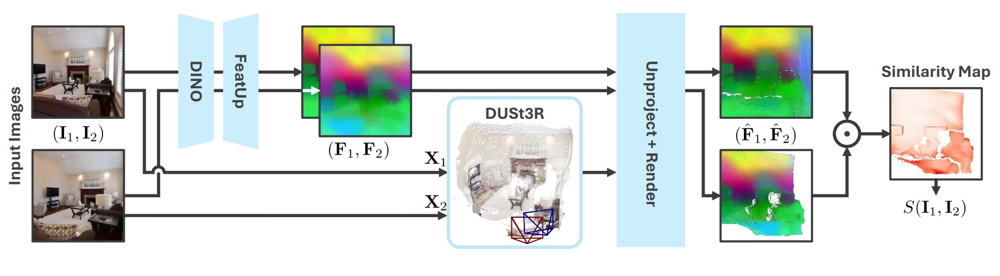

# `MET3R`: Measuring Multi-View Consistency in Generated Images.
<h5 align="center">

[]()
[]()
</h5>

### `TLDR: A differentiable metric to measure multi-view consistency between an image pair`. 

## 🔍 Method Overview 
<div align="center">
  
</div>

Our metric evaluates the consistency between images $\mathbf{I}_1$ and $\mathbf{I}_2$. Given such a pair, we apply **DUSt3R** to obtain dense 3D point maps $\mathbf{X}_1$ and $\mathbf{X}_2$. These point maps are used to project upscaled **DINO** features $\mathbf{F}_1$, $\mathbf{F}_2$ into the coordinate frame of $\mathbf{I}_1$, via unprojecting and rendering. We compare the resulting feature maps $\hat{\mathbf{F}}_1$ and $\hat{\mathbf{F}}_2$ in pixel space to obtain similarity $S(\mathbf{I}_1,\mathbf{I}_2)$.

## 📓 Abstract
We introduce **MET3R**, a metric for multi-view consistency in generated images. Large-scale generative models for multi-view image generation are rapidly advancing the field of 3D inference from sparse observations. However, due to the nature of generative modeling, traditional reconstruction metrics are not suitable to measure the quality of generated outputs and metrics that are independent of the sampling procedure are desperately needed. In this work, we specifically address the aspect of consistency between generated multi-view images, which can be evaluated independently of the specific scene. **MET3R** uses **DUSt3R** to obtain dense 3D reconstructions from image pairs in a feed-forward manner, which are used to warp image contents from one view into the other. Then, feature maps of these images are compared to obtain a similarity score that is invariant to view-dependent effects. Using **MET3R**, we evaluate the consistency of a large set of previous methods and our own, open, multi-view latent diffusion model.

## 📌 Dependencies

- **Python >= 3.6**
- **torch >= 2.1.0**
- **torchvision >= 0.16.0**
- **CUDA >= 11.3**

Tested with *CUDA 11.8*, *PyTorch 2.4.1*, *Python 3.10*

## 🛠️ Quick Setup
Simply install **MET3R** using the following command inside a bash terminal assuming prequisites are aleady installed and working.
```bash
pip install git+https://github.com/mohammadasim98/met3r
```

## 👷 Manual Install

Additionally **MET3R** can also be installed manually in a local development environment. 
#### Install Prerequisites
```bash
pip install -r requirements.txt
```
#### Installing **FeatUp**
**MET3R** relies on **FeatUp** to generate high resolution feature maps for the input images. Install **FeatUp** using the following command. 

```bash
pip install git+https://github.com/mhamilton723/FeatUp
```
Refer to [FeatUp](https://github.com/mhamilton723/FeatUp) for more details.

#### Installing **Pytorch3D**
**MET3R** requires Pytorch3D to perform point projection and rasterization. Install it via the following command.  
```bash 
pip install git+https://github.com/facebookresearch/pytorch3d.git
```
In case of issues related to installing and building Pytorch3D, refer to [Pytorch3d](https://github.com/facebookresearch/pytorch3d/blob/main/INSTALL.md) for more details. 

#### Installing **DUSt3R**
At the core of **MET3R** lies [DUSt3R](https://github.com/naver/dust3r) which is used to generate the 3D point maps for feature unprojection and rasterization. Due to LICENSE issues, we adopt **DUSt3R** as a submodule which can be downloaded as follows.
```bash
git submodule update --init --recursive
```

## 📣 Example Usage

Simply import and use **MET3R** in your codebase as follows.

```python
import torch
from met3r import MET3R

# Initialize MET3R
metric = MET3R(
    img_size=256, # Set it to `None` to use the input resolution on the fly!
    use_norm=True,
    feat_backbone="dino16",
    featup_weights="mhamilton723/FeatUp",
    dust3r_weights="naver/DUSt3R_ViTLarge_BaseDecoder_512_dpt"
).cuda()

# Prepare inputs
inputs = torch.randn((10, 2, 3, 256, 256)).cuda()
inputs = inputs.clip(-1, 1)

# Evaluate MET3R
score, mask = metric(images=inputs, return_score_map=False, return_projections=False)

# Should be between 0.3 - 0.35
print(score.mean().item())
```

## 📘 Citation
When using **MET3R** in your project, consider citing our work as follows.
```

```